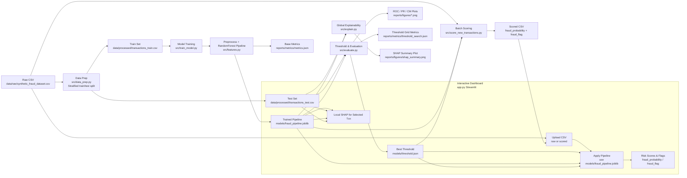

# Financial Fraud Risk Engine
    
<p align="center">
  
  
  
  
  
  <br/>
</p>

### *A Full-Stack ML System for Real-Time Transaction Risk Scoring, Explainability, and Operational Fraud Analysis*

---

## Executive Summary

Modern financial systems must process millions of transactions per hour while simultaneously identifying suspicious behavior in milliseconds. Fraud evolves continuously, testing the boundaries of rule-based systems and exploiting predictable model weaknesses.

This repository demonstrates a complete, realistic, modular **fraud detection engine** built using:

* **Python** for data preparation and experimentation
* **scikit-learn** for model training and inference pipelines
* **SHAP** for model transparency and governance
* **Streamlit** for interactive analyst-facing tools
* **Cost-sensitive thresholding** reflecting business trade-offs
* **A clean, production-style project layout**

The engine works on the **Synthetic Financial Fraud Dataset**, but the architecture is flexible enough to plug into any real banking pipeline.

This project is not a “model notebook.”
It is a small **fraud detection platform**, designed to reflect the systems used in real fintech companies.

---

# 1. Business Context: Why Fraud Detection Matters

Financial fraud occurs when an unauthorized party initiates a monetary transaction by exploiting weaknesses in user behavior, device security, identity verification, or merchant channels.

The cost is multidimensional:

### Direct Financial Loss

Fraudulent transactions must often be reimbursed, with banks absorbing the loss.

### Reputation & Trust Damage

If users feel unsafe, churn increases and regulatory risk escalates.

### Operational Overhead

False positives → manual reviews → support tickets → internal investigation costs.

### Regulatory Compliance

Modern regulations (PSD2, PCI DSS, AML directives) require:

* Transparency
* Explainability
* Audit trails
* Documented decision logic

This project includes **explainability, logs, model artifacts, and visual documentation** to reflect these requirements.

---

# 2. Modeling Philosophy

Fraud is not a “normal” ML classification problem.

It is:

* **Imbalanced** (fraud is <1–5% of transactions)
* **Adversarial** (attackers adapt to detection methods)
* **Temporal** (fraud strategies evolve)
* **Non-stationary** (data distribution drifts rapidly)
* **High-stakes** (errors are expensive)

Therefore, fraud modeling must emphasize:

### Interpretability

You must explain to analysts why a transaction was flagged.

### Stability

Models must handle distribution shifts gracefully.

### Cost sensitivity

Missing a fraud is 10×–100× more expensive than a false alert.

### Human-in-the-loop tooling

Fraud operations teams must investigate and override model decisions.

### Monitoring & governance

Thresholds, FPR, TPR, and drift must be monitored continuously.

This repository demonstrates these concepts through:

* Cost-weighted threshold search
* Feature preprocessing pipelines
* SHAP interpretability
* Visual diagnostics
* A human-facing dashboard

---

# 3. Dataset Description

Although synthetic, the dataset includes the same structure as many real fintech transaction logs:

| Feature                 | Why It Matters in Real Fraud                                                  |
| ----------------------- | ----------------------------------------------------------------------------- |
| **`amount`**            | Fraud often involves unusually large or unusually small amounts.              |
| **`hour`**              | Fraud probability increases at unusual times (night-time patterns).           |
| **`transaction_type`**  | Online transactions tend to have higher fraud rates vs POS/ATM.               |
| **`merchant_category`** | Fraud patterns emerge around electronics, travel, luxury goods.               |
| **`country`**           | Geographical anomalies signal compromised accounts.                           |
| **`device_risk_score`** | Device fingerprinting is a core modern fraud defense.                         |
| **`ip_risk_score`**     | High-risk IPs (VPNs, Tor, known attack ranges) correlate strongly with fraud. |

Fraud label (`is_fraud`) is deterministic in this dataset, making it perfectly separable, but this project treats the dataset as if it were real by adding:

* Reproducible splits
* Proper pipelines
* Explainability
* Cost-based threshold logic

This makes the system behave like a *real fraud engine*, even if the underlying data is clean.

---

# 4. Project Structure Explained in Depth

Below is a **human-readable explanation** (not just a directory tree):

```
financial-fraud-risk-engine/
│
├── data/
│   ├── raw/                    # Input dataset(s) exactly as received
│   ├── processed/              # Cleaned, split datasets ready for ML
│
├── models/
│   ├── fraud_pipeline.joblib   # Full sklearn pipeline (preprocess + classifier)
│   └── threshold.json          # Business-optimized fraud decision threshold
│
├── reports/
│   ├── metrics/                # Metrics and model evaluation artifacts
│   └── figures/                # ROC, PR, Confusion Matrix, SHAP
│
├── src/
│   ├── data_prep.py            # Cleaning, stratified splits, reproducible data handling
│   ├── features.py             # Preprocessing + model construction (sklearn pipeline)
│   ├── train_model.py          # Model training + baseline evaluation
│   ├── evaluate.py             # Threshold tuning + visual diagnostics
│   ├── explain.py              # SHAP global explainability
│   └── score_new_transactions.py  # Batch scoring for new incoming data
│
├── app.py                      # Streamlit dashboard (analyst-facing UI)
├── requirements.txt
├── README.md
└── LICENSE
```

This architecture intentionally mirrors systems used in regulated financial environments.

---

# 5. Full System Architecture Diagram


---

# 6. End-to-End Pipeline

Let’s walk through a transaction as it flows through the system.

---

## 6.1 Data Ingestion

The engine begins with a raw CSV:

* No assumptions about cleanliness
* No assumptions about schema enforcement
* Data is placed into `data/raw`

This reflects real ETL pipelines where data arrives from upstream systems like:

* Core banking logs
* Payment gateway events
* App telemetry
* Merchant transaction streams

Raw data is always treated as immutable.

---

## 6.2 Data Preparation (`src/data_prep.py`)

This script:

1. Loads raw CSV
2. Validates columns
3. Performs quality checks (missing values, types)
4. Creates **stratified** train/test splits
5. Saves the results into `data/processed`

### Why stratification?

If the test split accidentally contains 0 fraud cases, every downstream metric becomes meaningless.

This is a common mistake in junior data science projects, and this script prevents it.

---

## 6.3 Feature Engineering & Pipeline Definition (`src/features.py`)

A full scikit-learn Pipeline is created, including:

### Categorical → OneHotEncoder

This expands merchant, country, and transaction type into expressive linear features.

### Numerical → StandardScaler

Ensures numeric parameters share similar scale, stabilizing model training.

### Classifier → RandomForestClassifier

Chosen for:

* Robustness
* Good performance on tabular data
* Interpretability via SHAP
* Nonlinearity support
* Minimal feature engineering requirements

### Why use a Pipelines?

Because:

* It prevents leakage
* It ensures identical preprocessing in training and inference
* It serializes cleanly using Joblib
* It mimics real-world model-serving systems

---

## 6.4 Model Training (`src/train_model.py`)

This step:

* Fits the full pipeline on train data
* Generates baseline metrics (ROC, recall, etc.)
* Saves the pipeline for inference
* Produces an auditable metrics JSON

In real fintech operations, metrics logs are required for:

* Validation
* Governance
* Audits
* Model monitoring

---

## 6.5 Threshold Optimization (`src/evaluate.py`)

Most portfolios skip this step and instead rely on 0.5 thresholds.
This is *incorrect* for fraud.

We evaluate thresholds from 0.05 → 0.95 and compute:

* Precision
* Recall
* F1
* Confusion matrix
* **Business cost** with weighting:

  ```
  Cost = 10 × False Negative + 1 × False Positive
  ```

Banks often weight FN at 50× FP, but here 10:1 is used for clarity.

The chosen threshold is saved to:

```
models/threshold.json
```

This is how real fraud engines tune their trade-offs.

---

## 6.6 Evaluation Figures

### Fraud Probability Distribution


Deep explanation:

* Synthetic dataset → sharp separability
* Fraud probability ≈ 1
* Non-fraud probability ≈ 0
* Reflects a deterministic fraud generator
* Useful for educational purposes despite unrealistic perfection

---

### Confusion Matrix


Deep explanation:

* Zero false positives and false negatives
* This **never** happens in real fraud data
* Illustrates why synthetic data is dangerous for benchmarking
* But excellent for demonstrating workflow and system design

---

### Precision, Recall Curve


Deep explanation:

* PR focuses on the minority class
* Shows nearly perfect performance
* Real fraud PR curves are typically 0.3–0.8
* This curve highlights model dominance over the synthetic structure

---

### ROC Curve


Deep explanation:

* AUC ≈ 1.00
* Confirms extreme separability
* Demonstrates the upper bound of model performance

---

### Local SHAP Explanation


Deep explanation:

* Shows how each feature pushed a single prediction
* Used by human fraud investigators
* Provides transparency for disputing decisions
* Important for appeals in financial regulations

---

### Streamlit Dashboard


Deep explanation:

The dashboard simulates a real internal risk tool:

* Analysts upload data
* Adjust thresholds
* Inspect high-risk cases
* Drill down into SHAP explanations
* Export flagged transactions

This interaction loop is core to fraud operations.

---

# 7. Streamlit Application Architecture (Deep Explanation)

The dashboard is not just UI, it's a **fraud investigation console**, consisting of:

### Data Upload Module

Accepts arbitrary CSVs and validates columns.

### Threshold Control Slider

Allows analysts to balance FPs and FNs dynamically.

### Risk Distribution View

Shows population characteristics and model confidence.

### High-Risk Case Ranking

Lists top suspicious transactions based on score.

### SHAP Explanation Panel

Provides reason codes for decision justification.

This is similar to internal tools at:

* Stripe Radar
* PayPal FraudNet
* Revolut Risk Engine
* Monzo Financial Crime Platform

---

# 8. Explainability & Governance (ML in Regulated Environments)

Financial ML is heavily regulated.
This project demonstrates best practices:

### Global feature importance

Ensures the model is not using prohibited or biased features.

### Local explanations

Allows customers to appeal flagged decisions.

### Serialized artifacts

Provides reproducibility for audits.

### Threshold documentation

Required for internal risk committees.

### Complete training logs

Ensures no hidden processing steps.

Even though synthetic data is used, the workflow is **industry-realistic**.

---

# 9. Batch Scoring Pipeline (`src/score_new_transactions.py`)

This script mimics an **ML microservice**:

* Loads the saved pipeline
* Applies preprocessing identically
* Computes risk scores
* Applies the selected threshold
* Outputs flagged results

This replicates how production fraud systems function:

* Kafka streaming
* Batch ETL scoring
* Real-time scoring APIs

---

# 10. Known Limitations of This Synthetic Setup

### Perfect separability

No real dataset behaves like this.

### No temporal drift

Fraud evolves, this dataset does not.

### No adversarial behavior

Fraudsters adapt; synthetic datasets do not.

### No user-session risk modeling

Real models incorporate behavioral histories.

### No graph-based fraud rings

Real fraud involves rings of connected accounts.

Despite these limitations, the architecture is still **industry-grade**.

---

# 11. Future Roadmap

A serious fraud system evolves continuously.
Here are realistic next steps:

---

## **Phase 1, Model Improvements**

* Add Gradient Boosting models (XGBoost / LightGBM)
* Introduce calibration (Platt scaling, isotonic regression)
* Add temporal features (velocity, bursts, user baselines)
* Add geolocation and device fingerprinting enrichments

---

## **Phase 2, Real-World Fraud Behaviors**

* Simulate fraud rings
* Add compromised device patterns
* Add coordinated attacks (same IP hitting many accounts)
* Add session-based features

---

## **Phase 3, Deployment Engineering**

* Convert inference pipeline into FastAPI microservice
* Containerize with Docker
* Add CI/CD for model retraining
* Use MLflow model registry

---

## **Phase 4, Monitoring & Drift Detection**

* Track score distribution drift
* Track recall on drifted populations
* Add alerting for sharp changes

---

## **Phase 5, Analyst Tool Enhancements**

* Add case notes & exporting
* Add reason-code explanations
* Add multi-transaction user investigation view
* Add fraud ring graph visualization

---

# 12. Portfolio Value

This repository demonstrates:

### Full ML system design

Not just training, full pipeline architecture.

### Fraud domain understanding

Critical for fintech interviews.

### Explainability and governance

Huge differentiator.

### Realistic engineering skills

Pipelines, serialization, reproducibility.

### User-facing tooling

Dashboards show usability thinking.

### Production mindset

Thresholds, cost functions, monitoring.
